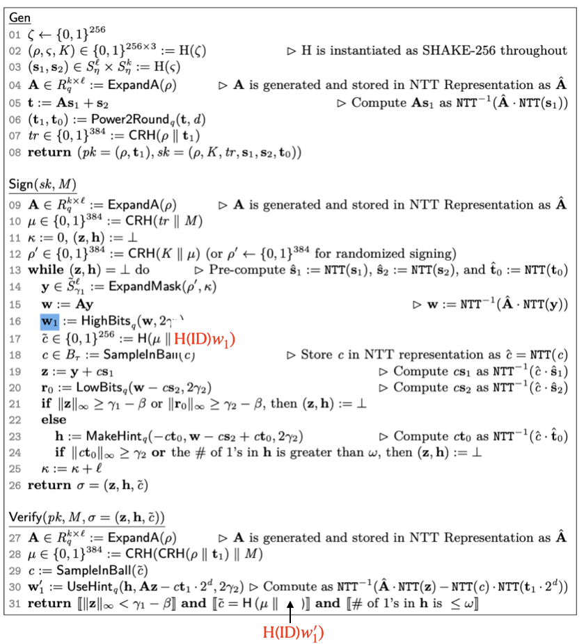

[](https://github.com/GiacomoPope/dilithium-py/blob/main/LICENSE)
[](https://github.com/GiacomoPope/dilithium-py/actions/workflows/ci.yml)
[](https://github.com/astral-sh/ruff)

# 工研院計畫 Dilithium Python Version 1 Prototype 
## 測試程式碼
1. 在 `dilithium-py-NCCU` 目錄下執行
```
python3 -m pip install -e . 
python3 test.py  
```
`test.py` 測試在 ML-DSA-44, ML-DSA-65 及 ML-DSA-87 之下是否可以正常簽章。
```
from dilithium_py.ml_dsa import ML_DSA_44, ML_DSA_65, ML_DSA_87
from dilithium_py.utilities.utils import reduce_mod_pm
from dilithium_py.polynomials.polynomials import PolynomialRingDilithium
import random

for i in range(100):
    pk, sk = ML_DSA_44.keygen()
    msg = b"test msg"
    ID = [random.randint(0, 1) for _ in range(20)]
    sig = ML_DSA_44.sign(sk, msg, ID)
    assert ML_DSA_44.verify(pk, msg, sig, ID)

for i in range(100):
    pk, sk = ML_DSA_65.keygen()
    msg = b"test msg"
    ID = [random.randint(0, 1) for _ in range(20)]
    sig = ML_DSA_65.sign(sk, msg, ID)
    assert ML_DSA_65.verify(pk, msg, sig, ID)

for i in range(100):
    pk, sk = ML_DSA_87.keygen()
    msg = b"test msg"
    ID = [random.randint(0, 1) for _ in range(20)]
    sig = ML_DSA_87.sign(sk, msg, ID)
    assert ML_DSA_87.verify(pk, msg, sig, ID)

print("ALL GOOD!")
```

## 演算法
修改 ML-DSA 演算法如下


## Functions 說明
- H(ID): 輸入 ID，回傳一個 k-by-k 矩陣（NTT domain）
- OneOneMapping(h_value): 由 h_value 生成出對應的 k-by-k 矩陣
- BinaryToRing(binary): 一個 0/1 list 生成一個 NTT 形式多項式